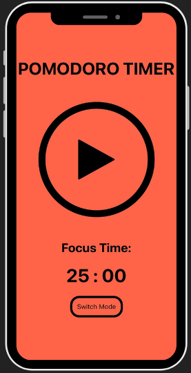
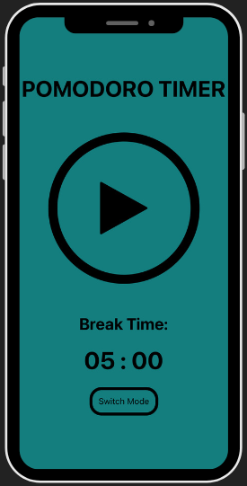

# Pomodoro Timer
Welcome to the Pomodoro Timer mobile app. This application is designed to help you effectively manage your work and breaks through the Pomodoro technique. It seamlessly transitions between focus time and break time intervals, thereby boosting productivity and ensuring regular rest. The simplicity in the colors palette helps with not getting distracted.


## Features
- Configure custom durations for focus and break times (code-only for now).
- Switch effortlessly between "Focus Time" and "Break Time" modes.
- Enjoy distinct simple visual themes for focus and relaxation.
- Intuitive controls for starting, stopping, and changing modes.
- Countdown display to monitor the time remaining.
- Audio notification at the end of each focus session.

## Technologies Used

- **TypeScript**: A statically typed superset of JavaScript that enhances code quality and provides improved development experiences.
- **React Native**: A framework for building native mobile applications using React, allowing for code reuse across multiple platforms.
- **Expo**: A toolchain and platform for building and deploying React Native applications with ease.

## Screenshots
<div style="justify-content: center;">
  
  
</div>

## Prerequisites
Before running the app, make sure you have the following prerequisites in place:

- Node.js
- Expo CLI (You can install it using `npm install -g expo-cli`)


## Installation
1. Clone this repository to your local machine.
2. Navigate to the project directory using your terminal.
3. Install the required dependencies by running:

```bash
npm install
```

## Usage
1. Start the app by executing the following command:

```bash
npm start
```
2. To launch the app, scan the displayed QR code using the Expo Go app on your iOS or Android device.


## Timer Settings
In this first version of this app you can customize the focus and break time durations only by adjusting the variables within the App.tsx file, in future updates you will be able to personalise the timers directly in-app:
```
const focusTimeMinutes = 25 * 60 * 1000; // Modify focus time duration (in milliseconds)
const breakTimeMinutes = 5 * 60 * 1000;  // Adjust break time duration (in milliseconds)
```

## Acknowledgments

- Sound Effect from <a href="https://pixabay.com/?utm_source=link-attribution&utm_medium=referral&utm_campaign=music&utm_content=47804">Pixabay</a>

#
# Please visit my web portfolio, Linkedin or GitHub profile by clicking directly here: https://alessandrofrondini.netlify.app/  and don't be shy to send me suggestions, always looking forward to improve myself!

## Contributing

Contributions are welcome! Feel free to submit issues or pull requests.